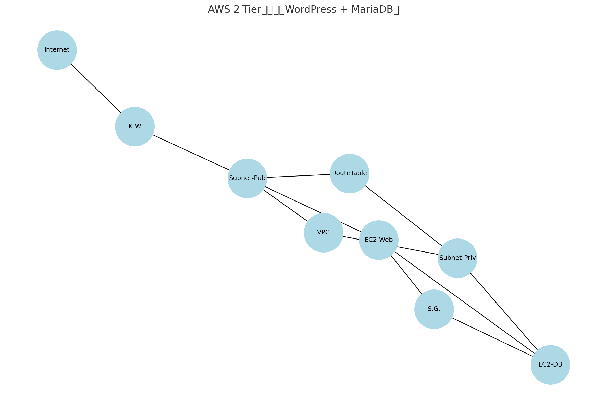

# AWS × WordPress 構成構築ログ

## 概要

AWS上にVPCから構成を始め、Webサーバー（WordPress）とDBサーバー（MariaDB）をEC2で分離。  
ネットワーク分離・パブリック/プライベートサブネット・セキュリティグループによる接続制御を行い、  
2ちゃん風掲示板機能を持つWordPressサイトを構築。

## 構成図

## 使用AWSサービス

- VPC
- サブネット（パブリック/プライベート）
- ルートテーブル
- インターネットゲートウェイ
- EC2（Webサーバー、DBサーバー）
- セキュリティグループ
- Elastic IP（Webサーバー用）

## ネットワーク構成

| サーバー種別 | サブネット | IP設定        | 備考                                      |
|--------------|------------|---------------|-------------------------------------------|
| Webサーバー   | パブリック | パブリックIP有 | HTTP/SSH接続許可、WordPress配置           |
| DBサーバー    | プライベート | プライベートIP | SSH接続、MariaDB設置、Webからの3306のみ許可 |

## セットアップ手順（概要）

1. **VPC作成**（CIDR例：10.0.0.0/16）
2. **サブネット作成**（Web用/DB用）
3. **インターネットゲートウェイ作成・アタッチ**
4. **ルートテーブル編集**（0.0.0.0/0 → IGW）
5. **セキュリティグループ設定**
   - Webサーバー：22, 80, 443開放
   - DBサーバー：3306のみ、WebサーバーのプライベートIPから許可
6. **EC2起動 × 2台**
   - Web：Apache or Nginx＋PHP＋WordPress
   - DB：MariaDB＋ユーザー/パスワード/DB作成
7. **SSHログイン → WordPress配置、`wp-config.php`編集**
8. **ブラウザからWebサーバーのパブリックIPにアクセス → 動作確認完了**

## 詰まったこと・感想

- DB接続設定で少し詰まった（wp-config.php編集）
- IGWやElastic IPで意図せず料金が発生して殺意が湧いた
- ゼロから構成作って公開まで持っていけたのは良い経験だった

---

## 備考

- 今後CloudFormationやTerraformなどで自動化も試したい
- コストが痛かったので削除済（現在稼働していません）  